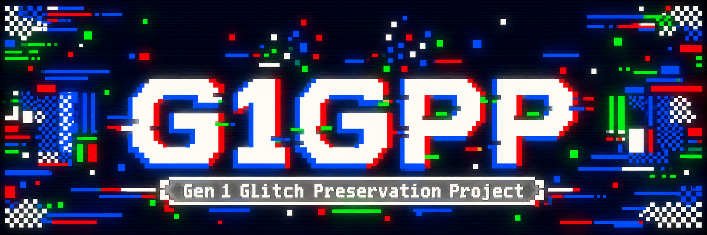

  

# Gen I Glitch Preservation Project (G1GPP)

Public source repository for the Gen 1 Glitch Preservation Project, a
Gen1Recomp mod focused on preserving authentic Pokémon Red/Blue glitch behavior
while protecting the real save file from destructive original-game
consequences.

This mod was primarily built using AI to write code, mostly as a learning experience for myself. I understand some people have strong opinions on the use AI for projects like this. I respect anyone's choice to not use this mod based on that knowledge.

This mod will not package any rom-derived artwork, sprites, music, etc. Any assets are reconstructed from the imported rom at run time.

## What is it?

G1GPP (Gen 1 Glitch Preservation Project) is a mod that aims to safely and accurately re-introduce bugs and glitches to the Gen1Recomp project. It also aims to recreate the myths and legends we grew up with in the days before the internet. There are also a sprinkling of lore-friendly additions, just to round out the mod.

## Compatibility and prerequisite

- Red and Blue gameplay are confirmed.
- Yellow is functional, but little testing has been done so far. Reconstructed glitches that weren't present in yellow are likewise not present now.
- At least one of Gold, Silver, or Crystal must be imported into Gen1Recomp.
  Enable G1GPP for that Gen II edition and launch it once. You only need to get as far as the title screen.

## Features

- Complete reconstruction of a multitude of glitch Pokémon and trainers in the Gen1Recomp.
  I used the emulator mGBA to systematically encounter, log, and record mountains of data on each and every glitch Pokémon starting with index 191 up to 255. That data was used to build battle and encounter data so that each of these glitches are now encounterable   in Gen1Recomp. You'll see the familiar "MissingNo." and "M" sprites, all faithfully recreated in Gen1Recomp using actual game data, rather than just including a sprite.
- Long range trainer glitch/ditto glitch restored, see https://bulbapedia.bulbagarden.net/wiki/Mew_glitch
- Old man glitch, see https://bulbapedia.bulbagarden.net/wiki/Old_man_glitch
- MissingNo. (all variants, including fossil and ghost), along with the sixth item duplication glitch.
- "Glitch City", stemming from an encounter with Pokémon ID 200, as well as the Safari Zone save/reload glitch.
- Enter cycling road without a bicycle.
- Mini-games, accessible via PC in every Pokécenter *Hint* You should always shut an old PC down properly, and not turn the power on and off rapidly. Definitely not exactly ten times!
- One of the Pokegods that I personally wasted hours trying to find. *Hint* There is a scientist at Cinnabar Island that hints at a Raichu evolution due to a mistranslation from Japan.
- More to come, suggestions welcome.
  
